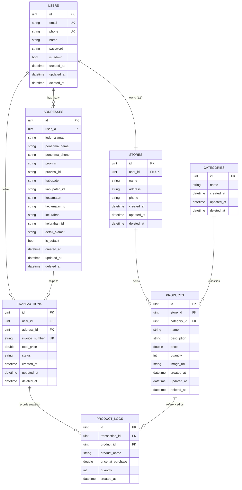

# Evermos Multi-Tenant E-Commerce RESTful API

[](https://golang.org)
[](https://gofiber.io)
[](https://gorm.io)
[](https://blog.cleancoder.com/uncle-bob/2012/08/13/the-clean-architecture.html)
[](LICENSE)

Backend RESTful API platform e-commerce multi-tenant yang tangguh, aman, dan siap pakai. Dibangun menggunakan bahasa pemrograman **Go (Golang)** dengan HTTP framework **Go Fiber v2**, persistence ORM **GORM**, dan basis data **MySQL 8.0**. Seluruh kode diorganisasi secara ketat mengikuti prinsip **Clean Architecture** (Robert C. Martin).

---

## 📑 Daftar Isi

- [Fitur Utama](#-fitur-utama)
- [Arsitektur & Struktur Folder](#-arsitektur--struktur-folder)
- [Diagram Entitas Basis Data (ERD)](#-diagram-entitas-basis-data-erd)
- [Prasyarat Sistem](#-prasyarat-sistem)
- [Panduan Instalasi & Menjalankan Aplikasi](#-panduan-instalasi--menjalankan-aplikasi)
- [Daftar Endpoint API](#-daftar-endpoint-api)
- [Eksplorasi API (Swagger UI & Postman)](#-eksplorasi-api-swagger-ui--postman)
- [Menjalankan Pengujian (Testing)](#-menjalankan-pengujian-testing)
- [Format Respon Standar](#-format-respon-standar)

---

## ✨ Fitur Utama

1. **Autentikasi & Otorisasi Terenkripsi (JWT & Bcrypt):**
   - Enkripsi kata sandi menggunakan salt hashing `bcrypt`.
   - Autentikasi stateless menggunakan **JWT (JSON Web Token)** dengan Bearer middleware.
   - Pengecekan keunikan `email` dan nomor telepon (`phone`).

2. **Automated Store Provisioning (Invarian #1):**
   - Setiap pengguna yang mendaftar melalui `/api/v1/auth/register` secara otomatis dibuatkan toko merchant bernama `"{UserName}'s Store"` dalam satu transaksi basis data atomik (relasi 1:1).

3. **Keamanan Zero-Trust Multi-Tenancy:**
   - Pengguna hanya memiliki hak akses penuh terhadap datanya sendiri.
   - Upaya mengakses atau memodifikasi toko, alamat, produk, atau pesanan milik pengguna lain akan ditolak (`403 Forbidden` atau `404 Not Found`).

4. **Hierarki Alamat Wilayah Administratif Indonesia:**
   - Mengikuti kode dan nama resmi pembagian wilayah Indonesia: `provinsi`, `provinsi_id`, `kabupaten`, `kabupaten_id`, `kecamatan`, `kecamatan_id`, `kelurahan`, `kelurahan_id`.
   - Manajemen alamat utama default secara atomik: pengaktifan `is_default = true` otomatis menonaktifkan alamat default sebelumnya.

5. **Tata Kelola Kategori Produk (RBAC - Admin Only):**
   - Penambahan, pembaruan, dan penghapusan kategori produk dibatasi hanya untuk akun Administrator (`is_admin == true`).
   - Pengguna publik dan reguler memiliki akses baca (*read-only*).

6. **Katalog Produk & Unggah Media Multipart:**
   - Pembuatan dan pembaruan produk mendukung unggah gambar file nyata (`multipart/form-data`) yang disimpan pada folder server `uploads/products/`.
   - Penelusuran katalog publik dengan filter pencarian nama (`search`), filter kategori (`category_id`), filter toko (`store_id`), pengurutan harga (`sort=price_asc|price_desc|newest`), dan paginasi (`limit` & `offset`).

7. **Engine Transaksi ACID & Log Historis Immutable (`product_logs`):**
   - Transaksi checkout dieksekusi dalam satu transaksi MySQL atomik:
     1. Validasi kepemilikan alamat pengiriman.
     2. Pengurutan ID produk (*ascending*) untuk mencegah *deadlock*.
     3. *Pessimistic Row Locking* (`SELECT ... FOR UPDATE`) untuk mencegah *race condition* dan *overselling*.
     4. Verifikasi dan pemotongan stok otomatis di inventaris.
     5. Pembuatan nomor invoice unik (`INV-{userID}-{timestamp}`).
     6. Penyimpanan snapshot harga satuan dan kuantitas saat pembelian ke dalam tabel `product_logs`.

---

## 🏛️ Arsitektur & Struktur Folder

Proyek ini menerapkan **Clean Architecture** dengan dependensi yang selalu mengarah ke dalam (*inward-pointing dependencies*):

```
[ Delivery Layer: Fiber HTTP Handlers & Middlewares ]
                       │
                       ▼
[ Application Business Layer: UseCases ]
                       │
                       ▼
[ Persistence Layer: Repository Interfaces & GORM Implementations ]
                       │
                       ▼
[ Enterprise Domain Layer: Entities & DTO Models ]
```

### Struktur Direktori:

```
.
├── app/
│   └── main.go                 # Entry point bootstrap aplikasi
├── bin/
│   └── evermos-api             # Binary hasil kompilasi produksi
├── docs/
│   └── swagger.json            # Spesifikasi OpenAPI 3.0
├── internal/
│   ├── helper/                 # Formatter respon JSON terpadu
│   ├── infrastructure/
│   │   ├── container/          # Dependency Injection (DI) Container
│   │   └── mysql/              # Koneksi MySQL pool & AutoMigrate
│   ├── pkg/
│   │   ├── entity/             # GORM Domain Entities (Database Models)
│   │   ├── model/              # Data Transfer Objects (DTOs) Request & Response
│   │   ├── repository/         # Abstraksi database & GORM queries
│   │   └── usecase/            # Aturan bisnis murni & isolasi multi-tenant
│   ├── server/
│   │   └── http/
│   │       ├── handler/        # Fiber HTTP Controllers
│   │       ├── middleware/     # JWT Auth & Admin RBAC Middlewares
│   │       └── httproute.go    # Registrasi rute endpoint
│   └── utils/                  # Utility JWT token & bcrypt hashing
├── test/
│   └── e2e/                    # Folder Khusus Pengujian Integrasi End-to-End
│       ├── test_helper.go      # Setup DB & Fiber test runner terpusat
│       ├── auth_e2e_test.go    # Test E2E autentikasi & auto-store
│       ├── user_store_e2e_test.go
│       ├── address_e2e_test.go
│       ├── category_e2e_test.go
│       ├── product_e2e_test.go
│       ├── transaction_e2e_test.go
│       └── swagger_e2e_test.go
├── uploads/
│   └── products/               # Folder penyimpanan file upload gambar
├── docker-compose.yaml         # Konfigurasi container MySQL 8.0
├── Evermos_API.postman_collection.json # Koleksi Postman lengkap dengan dokumentasi ID
├── go.mod & go.sum
└── .env.example
```

---

## 🗄️ Diagram Entitas Basis Data (ERD)



---

## 📋 Prasyarat Sistem

- **Go (Golang):** Versi `1.25+`
- **Basis Data:** MySQL `8.0+` (atau jalankan via Docker)
- **Containerization:** Docker & Docker Compose

---

## 🚀 Panduan Instalasi & Menjalankan Aplikasi

### 1. Kloning Repositori
```bash
git clone https://github.com/VUXXE/Rakamim-Evermost.git
cd Rakamim-Evermost
```

### 2. Konfigurasi Environment Variables
Salin template konfigurasi `.env.example` menjadi `.env`:
```bash
cp .env.example .env
```

Sesuaikan isi `.env` bila diperlukan:
```ini
APP_NAME=Evermos-Ecommerce-API
APP_PORT=8080
APP_ENV=development

DB_HOST=127.0.0.1
DB_PORT=3306
DB_USER=root
DB_PASSWORD=password
DB_NAME=evermos

JWT_SECRET=super_secret_jwt_key_evermos_2026_safe_and_long!
JWT_EXP_HOURS=72
```

### 3. Menjalankan Layanan MySQL
Gunakan Docker Compose untuk menyalakan basis data MySQL 8.0 secara otomatis:
```bash
docker compose up -d
```

### 4. Mengunduh Dependensi Go
```bash
go mod download
go mod tidy
```

### 5. Menjalankan Server Backend
```bash
go run ./app/main.go
```
*Server akan aktif dan melayani request pada: `http://localhost:8080`*

### 6. (Opsional) Mengompilasi Binary Produksi
```bash
go build -o bin/evermos-api ./app/main.go
./bin/evermos-api
```

---

## 📡 Daftar Endpoint API

Semua rute API terdaftar di bawah prefix `/api/v1`:

### 1. Autentikasi (`/auth`)
| Method | Endpoint | Akses | Keterangan |
|:---:|:---|:---:|:---|
| `POST` | `/api/v1/auth/register` | Publik | Registrasi akun & otomatis membuat Toko |
| `POST` | `/api/v1/auth/login` | Publik | Login & penerbitan token JWT |

### 2. Pengguna (`/users`)
| Method | Endpoint | Akses | Keterangan |
|:---:|:---|:---:|:---|
| `GET` | `/api/v1/users/me` | Bearer | Melihat profil pengguna yang sedang login |
| `PATCH` | `/api/v1/users/me` | Bearer | Memperbarui profil diri sendiri |
| `DELETE` | `/api/v1/users/me` | Bearer | Menghapus akun diri sendiri (*soft delete*) |
| `GET` | `/api/v1/users` | Admin | Melihat daftar seluruh pengguna terdaftar |
| `GET` | `/api/v1/users/:id` | Bearer | Melihat detail pengguna berdasarkan ID |

### 3. Toko (`/stores`)
| Method | Endpoint | Akses | Keterangan |
|:---:|:---|:---:|:---|
| `GET` | `/api/v1/stores/me` | Bearer | Melihat profil toko milik sendiri |
| `GET` | `/api/v1/stores` | Publik | Daftar toko publik dengan paginasi |
| `GET` | `/api/v1/stores/:id` | Publik | Melihat detail toko berdasarkan ID |
| `PATCH` | `/api/v1/stores/:id` | Bearer | Memperbarui toko (Isolasi Zero-Trust) |
| `DELETE` | `/api/v1/stores/:id` | Bearer | Menghapus toko milik sendiri |

### 4. Alamat Pengiriman (`/addresses`)
| Method | Endpoint | Akses | Keterangan |
|:---:|:---|:---:|:---|
| `POST` | `/api/v1/addresses` | Bearer | Tambah alamat (standar wilayah Indonesia) |
| `GET` | `/api/v1/addresses` | Bearer | Daftar alamat milik pengguna login |
| `GET` | `/api/v1/addresses/:id` | Bearer | Detail alamat (Isolasi Zero-Trust) |
| `PATCH` | `/api/v1/addresses/:id` | Bearer | Perbarui alamat pengiriman |
| `DELETE` | `/api/v1/addresses/:id` | Bearer | Hapus alamat pengiriman |

### 5. Kategori Produk (`/categories`)
| Method | Endpoint | Akses | Keterangan |
|:---:|:---|:---:|:---|
| `GET` | `/api/v1/categories` | Publik | Daftar kategori produk dengan paginasi |
| `GET` | `/api/v1/categories/:id` | Publik | Detail kategori berdasarkan ID |
| `POST` | `/api/v1/categories` | Admin | Tambah kategori baru (Khusus Admin) |
| `PATCH` | `/api/v1/categories/:id` | Admin | Perbarui nama kategori (Khusus Admin) |
| `DELETE` | `/api/v1/categories/:id` | Admin | Hapus kategori (Khusus Admin) |

### 6. Produk (`/products`)
| Method | Endpoint | Akses | Keterangan |
|:---:|:---|:---:|:---|
| `POST` | `/api/v1/products` | Bearer | Tambah produk baru (Multipart Form Upload) |
| `GET` | `/api/v1/products` | Publik | Katalog produk (filter `search`, `category_id`, `sort`, dll) |
| `GET` | `/api/v1/products/me` | Bearer | Daftar produk milik toko sendiri |
| `GET` | `/api/v1/products/:id` | Publik | Detail produk berdasarkan ID |
| `PATCH` | `/api/v1/products/:id` | Bearer | Perbarui produk (Isolasi Merchant) |
| `DELETE` | `/api/v1/products/:id` | Bearer | Hapus produk milik toko sendiri |

### 7. Transaksi (`/transactions`)
| Method | Endpoint | Akses | Keterangan |
|:---:|:---|:---:|:---|
| `POST` | `/api/v1/transactions` | Bearer | Checkout pesanan (ACID Transaction & Row Locks) |
| `GET` | `/api/v1/transactions/me` | Bearer | Riwayat transaksi belanja pembeli |
| `GET` | `/api/v1/transactions/me/:id` | Bearer | Detail transaksi & snapshot `product_logs` |
| `PATCH` | `/api/v1/transactions/me/:id` | Bearer | Perbarui status pesanan (`completed`/`cancelled`) |
| `GET` | `/api/v1/transactions` | Admin | Seluruh transaksi di platform (Khusus Admin) |

---

## 🔍 Eksplorasi API (Swagger UI & Postman)

### 1. Melalui Swagger UI (Browser)
Aplikasi menyediakan antarmuka interaktif bawaan:
- Buka browser pada alamat: **[http://localhost:8080/swagger](http://localhost:8080/swagger)** atau **[http://localhost:8080/docs](http://localhost:8080/docs)**
- Spesifikasi OpenAPI 3.0: `http://localhost:8080/swagger/doc.json`
- Gunakan tombol **Authorize** untuk memasukkan JWT Bearer Token (`Bearer <token>`) agar dapat menguji endpoint yang terproteksi secara langsung.

### 2. Melalui Postman Collection
Koleksi Postman v2.1.0 lengkap telah disediakan pada file:
`Evermos_API.postman_collection.json`
- Buka Postman -> Klik **Import** -> Pilih file `Evermos_API.postman_collection.json`.
- Seluruh 8 modul telah dilengkapi deskripsi lengkap berbahasa Indonesia pada tab **Documentation / Docs**.
- Variabel `{{base_url}}`, `{{token}}`, dan `{{admin_token}}` telah dikonfigurasi secara dinamis.

---

## 🧪 Menjalankan Pengujian (Testing)

Pengujian dibagi menjadi pengujian unit terisolasi dan pengujian integrasi End-to-End (E2E) pada folder khusus `test/e2e/`:

```bash
# 1. Menjalankan seluruh test di folder khusus test/
go test -v ./test/e2e/...

# 2. Menjalankan seluruh test di proyek (Unit + Integration E2E)
go test -v ./...

# 3. Menjalankan test dengan Race Condition Detector
go test -race ./...

# 4. Memeriksa coverage pengujian
go test -coverprofile=coverage.out ./...
go tool cover -func=coverage.out
```

---

## 📦 Format Respon Standar

Semua endpoint mengembalikan struktur respon JSON yang seragam:

### Respon Sukses
```json
{
  "code": 200,
  "message": "operation successful",
  "data": { ... }
}
```

### Respon Sukses dengan Paginasi
```json
{
  "code": 200,
  "message": "list fetched successfully",
  "data": {
    "total": 42,
    "limit": 10,
    "offset": 0,
    "items": [ ... ]
  }
}
```

### Respon Error
```json
{
  "code": 400,
  "message": "validation error or description",
  "error": "detail error message"
}
```
