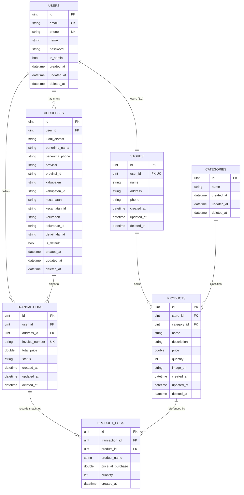

# Rakamin Evermos: Backend E-Commerce API Service


Backend Service E-Commerce berbasis **Go (Golang)** dengan penerapan **Clean Architecture**, dibangun sebagai tugas akhir Rakamin Academy × Evermos Virtual Internship.

Aplikasi ini mencakup fitur lengkap mulai dari Autentikasi, Pembuatan Toko Otomatis, Manajemen Produk (Multipart Upload), Transaksi Atomik (Row Locking & Immutable Product Logs), hingga Pengelolaan Alamat Standar Wilayah Indonesia.

---

## Daftar Isi
- [Tech Stack](#tech-stack)
- [Struktur Project](#struktur-project)
- [Fitur & Arsitektur](#fitur--arsitektur)
- [Database Schema (ERD)](#database-schema-erd)
- [Testing](#testing)
- [API Endpoints](#api-endpoints)
- [Cara Menjalankan](#cara-menjalankan)
- [Dokumentasi Lengkap](#dokumentasi-lengkap)

---

## Tech Stack

| Komponen | Teknologi |
| :--- | :--- |
| **Language** | Go 1.25+ |
| **HTTP Framework** | Go Fiber v2 (`github.com/gofiber/fiber/v2`) |
| **Database** | MySQL 8.0 (Docker & Production) |
| **ORM** | GORM (`gorm.io/gorm` + `gorm.io/driver/mysql`) |
| **Auth & Security** | JWT (`golang-jwt/jwt/v5`) + Bcrypt Password Hashing |
| **API Docs** | Interactive Swagger UI / OpenAPI 3.0.3 (`/swagger`) |
| **API Client Docs**| Postman Collection v2.1.0 (Lengkap Bahasa Indonesia) |
| **Testing** | `testify/assert` + `testify/require` + Go Race Detector |
| **Administrative Standard** | Standar Kode & Wilayah Indonesia (Provinsi, Kabupaten, Kecamatan, Kelurahan) |

---

## Struktur Project

Penerapan **Clean Architecture** memisahkan *Business Logic* dengan kerangka eksternal secara konsisten:

```text
.
├── app/
│   └── main.go                     # Entry point + bootstrap server
├── bin/
│   └── evermos-api                 # Standalone compiled production binary
├── docs/
│   └── swagger.json                # Spesifikasi OpenAPI 3.0.3
├── internal/
│   ├── helper/                     # Formatter respon JSON terpadu & pagination
│   ├── infrastructure/
│   │   ├── container/              # Dependency Injection (DI) Container
│   │   └── mysql/                  # Connection pooling & GORM AutoMigrate
│   ├── pkg/
│   │   ├── entity/                 # GORM Domain Entities (7 model basis data)
│   │   ├── model/                  # Data Transfer Objects (DTOs Request & Response)
│   │   ├── repository/             # Abstraksi database & GORM persistence
│   │   └── usecase/                # Business logic & isolasi multi-tenant
│   ├── server/
│   │   └── http/
│   │       ├── handler/            # Fiber HTTP Controllers murni
│   │       ├── middleware/         # JWT Auth & Admin RBAC Middlewares
│   │       └── httproute.go        # Registrasi endpoint & rute
│   └── utils/                      # Bcrypt password hashing & JWT lifecycle
├── test/
│   └── e2e/                        # Folder khusus pengujian E2E & integrasi
│       ├── test_helper.go          # Centralized test runner & database auto-migrate
│       ├── auth_e2e_test.go
│       ├── user_store_e2e_test.go
│       ├── address_e2e_test.go
│       ├── category_e2e_test.go
│       ├── product_e2e_test.go
│       ├── transaction_e2e_test.go
│       └── swagger_e2e_test.go
├── uploads/
│   └── products/                   # Penyimpanan fisik file gambar produk
├── Evermos_API.postman_collection.json # Koleksi Postman lengkap dengan dokumentasi ID
├── docker-compose.yaml             # Layanan MySQL 8.0 otomatis
├── .env.example                    # Template konfigurasi environment
├── go.mod & go.sum
└── README.md
```

> [!NOTE]
> **Clean Architecture Boundary:** Folder `internal/server/http/handler/` murni hanya menangani request/response HTTP. Seluruh validasi kepemilikan dan aturan bisnis berada di `internal/pkg/usecase/`, dan seluruh test integrasi terisolasi di folder `test/e2e/`.

---

## Fitur & Arsitektur

### Modul 1: Autentikasi & Registrasi
- **Register & Auto-Create Toko (Invarian #1)**: Dalam satu *Database Transaction* atomik, akun pengguna dibuat bersamaan dengan toko merchant bernama `"{UserName}'s Store"` (relasi 1:1).
- **Login JWT**: Kata sandi di-hash menggunakan `bcrypt`. Token JWT di-generate dengan masa berlaku terkonfigurasi.
- **Validasi Keunikan**: `email` dan `phone` wajib unik dan divalidasi ganda di level database dan aplikasi.

### Modul 2: Wilayah & Alamat Pengiriman
- **Standar Hierarki Wilayah Indonesia**: Menyimpan data resmi `provinsi`, `provinsi_id`, `kabupaten`, `kabupaten_id`, `kecamatan`, `kecamatan_id`, `kelurahan`, `kelurahan_id`.
- **Atomic Default Rebalancing**: Menandai sebuah alamat sebagai default (`is_default = true`) secara otomatis menonaktifkan status default pada alamat-alamat lama dalam satu transaksi database.
- **Isolasi Alamat**: Pengguna hanya dapat melihat, mengedit, dan menghapus alamat miliknya sendiri (`404 Not Found` jika mengakses alamat orang lain).

### Modul 3: Produk & Kategori
- **Multipart Upload**: Upload foto produk asli melalui `multipart/form-data` yang disimpan ke folder server `uploads/products/{userID}_{timestamp}_{filename}`.
- **Admin RBAC Kategori**: Manajemen kategori (`POST`, `PATCH`, `DELETE` `/categories`) diproteksi ketat hanya untuk Administrator (`is_admin == true`). Pengguna reguler ditolak dengan `403 Forbidden`.
- **Katalog Publik & Filtering**: Penelusuran produk publik dengan filter substring nama (`search`), filter kategori (`category_id`), filter toko (`store_id`), pengurutan harga (`sort=price_asc|price_desc|newest`), dan paginasi terpadu.
- **Isolasi Merchant**: Penjual hanya dapat memperbarui atau menghapus produk milik tokonya sendiri (`403 Forbidden` jika melanggar).

### Modul 4: Transaksi Atomik & Checkout Engine
- **Pessimistic Row Locking (`FOR UPDATE`)**: Mencegah *race condition* dan *overselling* stok pada saat lonjakan pesanan bersamaan.
- **Deadlock Prevention**: Pengurutan ID produk (*ascending*) sebelum penguncian baris database.
- **Validasi & Deduct Stok Otomatis**: Memastikan kuantitas stok mencukupi sebelum memotong stok secara instan di inventaris.
- **Invoice Number Generator**: Format unik otomatis `INV-{userID}-{timestamp}`.
- **Immutable Historical Snapshots (`product_logs`)**: Snapshot harga satuan dan kuantitas produk saat pembelian disalin secara permanen ke tabel `product_logs`. Perubahan harga produk di kemudian hari tidak merusak integritas invoice lama.

### Modul 5: Security & Multi-Tenancy
- **Zero-Trust Multi-Tenancy**: Data antar-pengguna terisolasi penuh. Seluruh operasi mengekstrak `userID` dari token JWT terverifikasi.
- **Soft Delete Terpusat**: Seluruh entitas menggunakan `gorm.DeletedAt` sehingga data historis tetap terlindungi.
- **Connection Pooling Teroptimasi**: Konfigurasi `MaxOpenConns`, `MaxIdleConns`, dan `ConnMaxLifetime` untuk efisiensi koneksi database.

---

## Database Schema (ERD)



---

## Testing

Pengujian dilakukan secara komprehensif mencakup **Unit Testing** pada lapis domain & utilitas, serta **Integration / E2E Testing** di folder khusus `test/e2e/` menggunakan instance MySQL aktif.

```bash
# 1. Menjalankan seluruh pengujian di folder khusus test/e2e
go test -v ./test/e2e/...

# 2. Menjalankan seluruh test suite di proyek (Unit + E2E)
go test -v ./...

# 3. Menjalankan pengujian dengan Race Condition Detector
go test -v -race ./...

# 4. Memeriksa coverage pengujian
go test -coverprofile=coverage.out ./...
go tool cover -func=coverage.out
```

---

## API Endpoints

Seluruh endpoint terpusat pada base path `/api/v1`:

<details>
<summary><b>Lihat Ringkasan Daftar Endpoint</b></summary>

### Public Routes
| Method | Rute | Deskripsi |
| :--- | :--- | :--- |
| `POST` | `/api/v1/auth/register` | Pendaftaran User & Auto-Create Toko |
| `POST` | `/api/v1/auth/login` | Mendapatkan JWT Bearer Token |
| `GET` | `/api/v1/stores` | List Toko Terdaftar (Paginasi) |
| `GET` | `/api/v1/stores/:id` | Detail Toko berdasarkan ID |
| `GET` | `/api/v1/categories` | List Kategori Produk (Paginasi) |
| `GET` | `/api/v1/categories/:id` | Detail Kategori berdasarkan ID |
| `GET` | `/api/v1/products` | Katalog Produk (Search, Filter, Sort) |
| `GET` | `/api/v1/products/:id` | Detail Produk berdasarkan ID |
| `GET` | `/api/v1/health` | Health Check Server |
| `GET` | `/swagger` | Antarmuka Interaktif Swagger UI |
| `GET` | `/swagger/doc.json` | Spesifikasi OpenAPI 3.0 (JSON) |

### Protected Routes (Bearer Token)
| Method | Rute | Deskripsi |
| :--- | :--- | :--- |
| `GET` | `/api/v1/users/me` | Lihat profil sendiri |
| `PATCH`| `/api/v1/users/me` | Perbarui profil sendiri |
| `DELETE`| `/api/v1/users/me` | Hapus akun sendiri (*soft delete*) |
| `GET` | `/api/v1/users/:id` | Detail user berdasarkan ID |
| `GET` | `/api/v1/stores/me` | Lihat toko merchant sendiri |
| `PATCH`| `/api/v1/stores/:id` | Perbarui toko sendiri (Zero-Trust) |
| `DELETE`| `/api/v1/stores/:id` | Hapus toko sendiri |
| `POST` | `/api/v1/addresses` | Tambah alamat pengiriman baru |
| `GET` | `/api/v1/addresses` | Daftar alamat milik sendiri |
| `GET` | `/api/v1/addresses/:id` | Detail alamat sendiri |
| `PATCH`| `/api/v1/addresses/:id` | Perbarui alamat sendiri |
| `DELETE`| `/api/v1/addresses/:id` | Hapus alamat sendiri |
| `POST` | `/api/v1/products` | Tambah produk (Multipart Form Upload) |
| `GET` | `/api/v1/products/me` | Daftar produk milik toko sendiri |
| `PATCH`| `/api/v1/products/:id` | Perbarui produk sendiri |
| `DELETE`| `/api/v1/products/:id` | Hapus produk sendiri |
| `POST` | `/api/v1/transactions` | Checkout pesanan (ACID Transaction) |
| `GET` | `/api/v1/transactions/me` | Riwayat pesanan sendiri |
| `GET` | `/api/v1/transactions/me/:id`| Detail pesanan & log produk historis |
| `PATCH`| `/api/v1/transactions/me/:id`| Perbarui status pesanan (`completed`/`cancelled`) |

### Admin Routes (`is_admin == true`)
| Method | Rute | Deskripsi |
| :--- | :--- | :--- |
| `GET` | `/api/v1/users` | List seluruh user terdaftar (Admin Only) |
| `POST` | `/api/v1/categories` | Tambah kategori baru (Admin Only) |
| `PATCH`| `/api/v1/categories/:id` | Perbarui kategori (Admin Only) |
| `DELETE`| `/api/v1/categories/:id` | Hapus kategori (Admin Only) |
| `GET` | `/api/v1/transactions` | List seluruh transaksi platform (Admin Only) |

</details>

---

## Cara Menjalankan

### 1. Setup Database
Pastikan layanan Docker atau MySQL aktif. Salin konfigurasi environment:
```bash
cp .env.example .env
```

Jalankan MySQL 8.0 melalui Docker Compose:
```bash
docker compose up -d
```

### 2. Jalankan Server
```bash
go run app/main.go
```
*Server akan berjalan di port `:8080`.*

Atau jalankan binary produksi yang sudah terkompilasi:
```bash
./bin/evermos-api
```

### 3. Eksplorasi API lewat Swagger UI
Buka browser pada alamat:
👉 **[http://localhost:8080/swagger](http://localhost:8080/swagger)** (atau [http://localhost:8080/docs](http://localhost:8080/docs))

1. Lakukan registrasi atau login pada endpoint `POST /api/v1/auth/login`.
2. Salin token JWT yang dihasilkan.
3. Klik tombol hijau **Authorize 🔓** di pojok kanan atas Swagger UI.
4. Masukkan token dengan format: `Bearer {TOKEN}`.
5. Jalankan pengetesan endpoint terproteksi secara interaktif langsung dari browser!

### 4. Eksplorasi API lewat Postman Collection
Import file **`Evermos_API.postman_collection.json`** ke dalam Postman:
- Seluruh endpoint sudah dikelompokkan dalam 8 modul rapi.
- Dilengkapi dengan dokumentasi lengkap berbahasa Indonesia pada tab **Docs / Documentation** di Postman.
- Variabel lingkungan terkonfigurasi otomatis: `{{base_url}}`, `{{token}}`, dan `{{admin_token}}`.

---

## Dokumentasi Lengkap

| Dokumen | Lokasi File / URL |
| :--- | :--- |
| **Spesifikasi OpenAPI 3.0 (JSON)** | `docs/swagger.json` atau `/swagger/doc.json` |
| **Koleksi Postman v2.1.0** | `Evermos_API.postman_collection.json` |
| **Antarmuka Swagger UI** | `http://localhost:8080/swagger` |
| **Pengujian Integrasi E2E** | `test/e2e/` |
| **Entity Database Models** | `internal/pkg/entity/` |

---

## License

Didistribusikan di bawah lisensi MIT. Lihat file `LICENSE` untuk informasi lebih lanjut.
